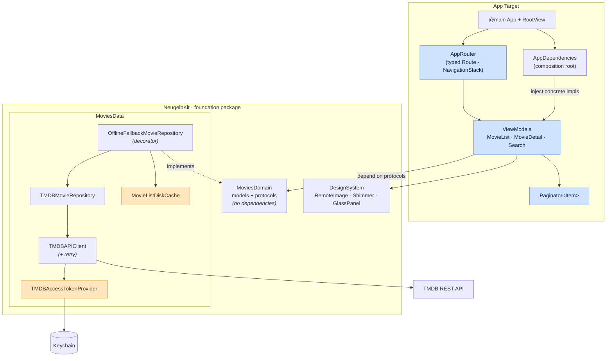
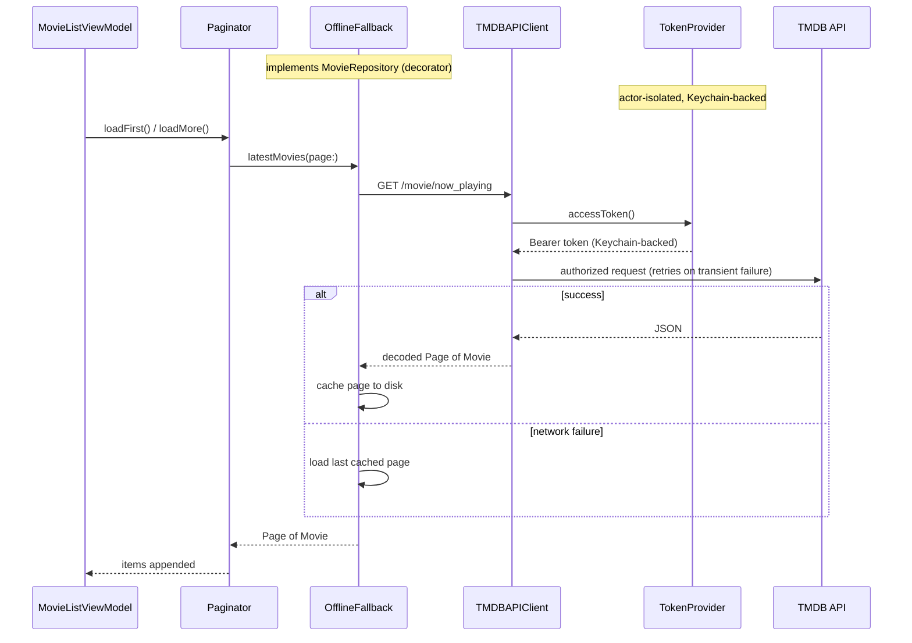

# Neugelb iOS Challenge task

A SwiftUI client for [The Movie Database (TMDB)](https://www.themoviedb.org) — latest movies with infinite scroll, a detail screen, and debounced search. Built for the Neugelb iOS challenge.

The brief is small enough to solve in a single view. I deliberately didn't. This codebase is structured the way I'd structure a feature in a team that has to live with it: a thin, testable domain at the core, swappable infrastructure at the edges, and exactly one place that knows how the concrete pieces fit together. The notes below explain not just *what* the structure is, but *which alternatives I rejected and why*.

- **Platform:** iOS 18+ · SwiftUI · Swift 6 (strict concurrency)
- **Localization:** English + German · Dynamic Type · light/dark
- **Tests:** deterministic unit tests across the app and the foundation package

---

## Design goals

1. **Policy independent of detail.** View models depend on protocols, never on TMDB, `URLSession`, or the Keychain. Swapping the backend or the cache touches one file.
2. **One composition root.** Concrete types are named in exactly one place (`AppDependencies`). Everywhere else receives abstractions.
3. **Resilience by composition.** Offline fallback, retry, and re-auth are layered as decorators, not branches scattered through the networking code.
4. **Correct by construction under Swift 6.** Mutable shared state is actor-isolated; UI state is `@MainActor`. The compiler enforces the threading model.

---

## Architecture

MVVM with a lightweight router. The reusable foundation lives in a Swift package (`NeugelbKit`); feature screens and view models live in the app target and build on top of it. The dependency arrows only ever point *inward* — toward the domain.

Blue nodes are `@MainActor` (UI state); amber nodes are `actor`-isolated infrastructure. Dependency arrows point inward, toward the domain.



| Layer | Lives in | Responsibility | Depends on |
| --- | --- | --- | --- |
| **MoviesDomain** | `NeugelbKit` | Model types (`Movie`, `MovieDetails`, `Page`) and abstractions (`MovieRepository`, `ImageURLResolving`). No Apple-framework or third-party coupling. | nothing |
| **MoviesData** | `NeugelbKit` | TMDB networking, DTO decoding, repository implementations, offline disk cache, Keychain token storage. | MoviesDomain |
| **DesignSystem** | `NeugelbKit` | App-agnostic UI primitives — remote images, shimmer skeletons, glass panels, rating badges. | — |
| **Features** | App target | SwiftUI screens + `@Observable` view models, plus a shared generic `Paginator`/`MovieGridView`. | MoviesDomain, DesignSystem |
| **Composition root** | App target | `AppDependencies` builds the concrete graph; `AppRouter` owns navigation. | MoviesData, MoviesDomain |

### Request flow

The view model talks only to the `MovieRepository` protocol. What's actually behind it — a cache-backed, retrying TMDB client — is invisible to the UI.



---

## Concurrency model

The app targets **Swift 6 strict concurrency**, so the threading contract is checked at compile time rather than hoped for at runtime:

- **UI state is `@MainActor`.** View models, `AppRouter`, and the generic `Paginator` are `@MainActor @Observable` — no manual hops back to the main thread, no data races on published state.
- **Shared mutable infrastructure is actor-isolated.** `TMDBAccessTokenProvider` (caches and seeds the token) and `MovieListDiskCache` (the offline store) are `actor`s, so concurrent reads/writes are serialized without locks.
- **Everything crossing a boundary is `Sendable`.** Domain models, DTOs, and protocols are `Sendable`, which is what lets the compiler prove the above.

The result is a unidirectional flow — intent goes down through async calls, state comes back up through `@Observable` — with the actor boundaries doing the synchronization.

---

## Testing strategy

Tests target the **seams**, not the screens — the risk lives in the logic (pagination, retry, token fallback, decoding), not in declarative SwiftUI layout. Because every collaborator is a protocol, the suite runs entirely in-memory: the HTTP transport is stubbed, so the networking layer is fully exercised without opening a real socket — deterministic and flake-free.

End-to-end UI flows aren't unit-tested by design — XCUITest is the planned next layer, and the accessibility identifiers it needs are already in place (see *Limitations*).

- **Domain/data tests** (`NeugelbKit` package): the **TMDB networking layer** — endpoint construction, auth-header injection, HTTP error mapping, retry, and empty/bodyless responses — plus DTO decoding against JSON fixtures, token resolution (Keychain → bundled seed → prompt), and the offline-fallback decorator. Verified with a stubbed `HTTPClient` and an in-memory `SecretStore`.
- **Feature tests** (app target): the generic `Paginator` (load-more, retry, empty/terminal states), search debounce + suggestion behavior, detail loading, and router navigation — driven by a `MovieRepositoryMock`.
- **Shared doubles, defined once.** `TestSupport` is a library product holding the mocks/factories used by *both* surfaces, so a fake is never duplicated. Data-layer-only fakes (HTTP, secrets, fixtures) stay local to the package tests, where they belong.

```sh
make test          # everything (package + app)
make test-app      # app-target unit tests
make test-package  # NeugelbKit package tests
```

> The two surfaces run in separate containers (host-app target vs. SPM package) that a single `xcodebuild` invocation can't combine, so the `Makefile` is the canonical runner.

---

## Key decisions & trade-offs

**Foundation in a package, features in the app.**
Domain, data, and design-system are reusable and independently testable, so they live in `NeugelbKit`. Feature screens stay in the app target.
- *Alternative rejected:* one SPM module per feature. It buys enforced boundaries but taxes every change with `public` annotations, per-module resource bundles, and string-catalog fragmentation — overkill for code that isn't shared across apps. I kept the package surface small and intentional instead.

**Resilience as decorators, not conditionals.**
`OfflineFallbackMovieRepository` wraps the remote repository plus a disk cache; retry lives inside `TMDBAPIClient`.
- *Trade-off:* a couple more small types, in exchange for networking code that has no idea caching or retry exists. Each concern is testable in isolation and composable in the one place that assembles them.

**One generic `Paginator` for list *and* search.**
Load-more, retry, dedup, and terminal-state logic exist once, behind `Paginator<Item>`.
- *Trade-off:* a generic constraint (`Identifiable & Hashable & Sendable`) over copy-pasted pagination in two view models. The constraint is cheap; the duplication wouldn't have been.

**Keychain-first token with a graceful prompt.**
No secrets in the repo. The token resolves Keychain → optional bundled `Secrets.plist` → first-launch entry screen, and a rejected token re-prompts in place.
- *Honest limitation:* any client-side secret is extractable from a device. The Keychain only protects it at rest. See *Limitations* — the real fix is server-side.

---

## Project structure

```
.
├── NeugelbCodingChallenge-iOS-FarazAhmed/      # App target
│   ├── …App.swift / RootView.swift             # Entry, NavigationStack host, token sheet
│   ├── AppDependencies.swift                   # Composition root
│   └── Features/{MovieList,MovieDetail,Search,Navigation,Common}/
│
├── Packages/NeugelbKit/Sources/                # Foundation SPM package
│   ├── MoviesDomain/                           # Models + protocols
│   ├── MoviesData/                             # TMDB networking, repos, Keychain
│   ├── DesignSystem/                           # Reusable UI primitives
│   └── TestSupport/                            # Shared mocks & factories
│
├── NeugelbCodingChallenge-iOS-FarazAhmedTests/ # App-target unit tests
├── Makefile                                     # `make test`
└── Secrets.example.plist                        # Token template (see Setup)
```

---

## Setup

**Requirements:** Xcode 16+ (iOS 18 SDK) and an iOS 18 simulator (defaults to iPhone 17 Pro).

**TMDB token.** The app authenticates with a TMDB **v4 read access token** (a Bearer token), supplied either way:

1. **Zero config:** build and run. With no token found, the app prompts once and stores it in the Keychain.
2. **Bundled secret (for repeat runs):**
   ```sh
   cp Secrets.example.plist NeugelbCodingChallenge-iOS-FarazAhmed/Secrets.plist
   # set TMDB_ACCESS_TOKEN in the copy (gitignored; seeds the Keychain on first launch)
   ```

Get a token at <https://www.themoviedb.org/settings/api>.

---

## Limitations & what I'd do next

A deliberate, honest list — these are choices scoped for a challenge, not oversights:

- **Token belongs on a server.** The production answer is a thin backend proxy that holds the TMDB credential and the app talks to *that*. The Keychain flow here is the best a client-only app can do.
- **Image caching is `URLSession`-default.** Fine at this scale; a real catalog wants a bounded disk cache with eviction (or Nuke/Kingfisher) and prefetching ahead of the scroll.
- **Offline cache is the last list only.** It proves the decorator seam. A fuller version would cache detail pages and search, with a TTL and a freshness indicator.
- **UI tests are the next layer.** Accessibility identifiers are already in place (`movie_list.*`, `search.*`, `movie_detail.*`, `token_entry.*`) so XCUITest flows can be added against a launch-arg network stub without touching production code.
- **Observability.** No analytics/crash reporting wired up; the composition root is the natural injection point when it's needed.
