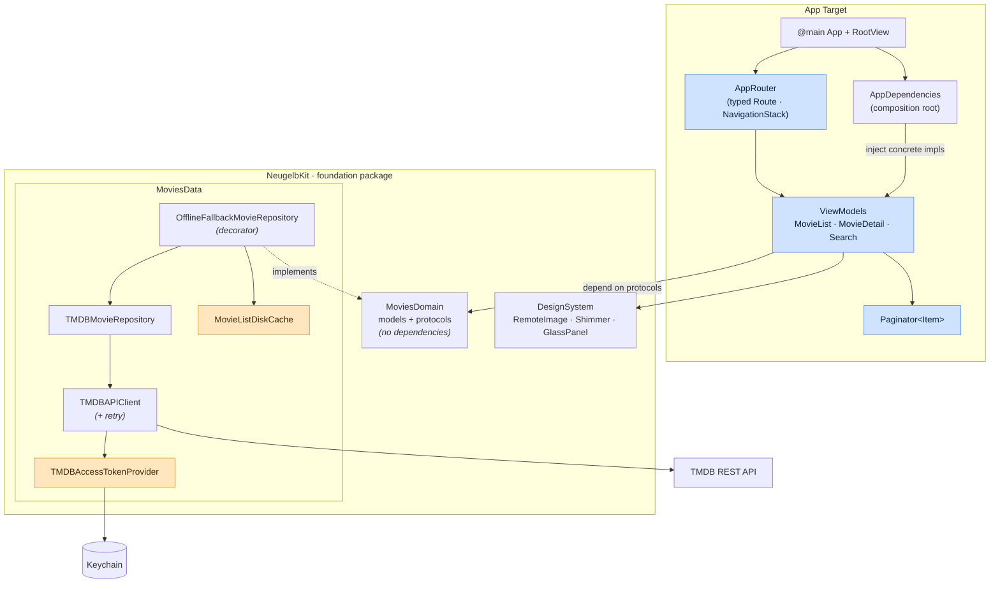
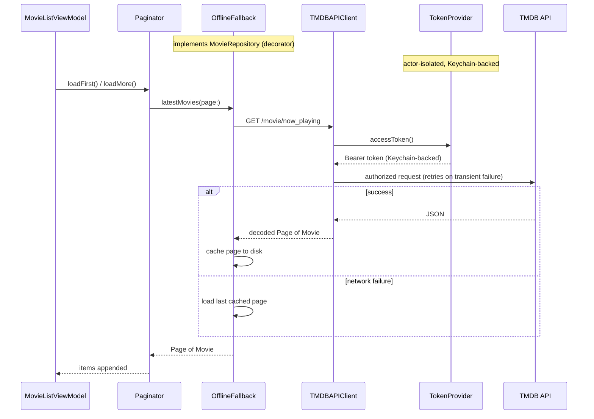

# Neugelb iOS Challenge task

A SwiftUI client for [The Movie Database (TMDB)](https://www.themoviedb.org). It shows the latest movies with infinite scroll, a detail screen, and search with live suggestions. Built for the Neugelb iOS challenge.

The app is small, but I've put it together the way I'd build something a team has to maintain. The domain and data layers sit behind protocols, the UI depends only on those protocols, and the concrete types are wired up in one place. The sections below cover how it fits together and the reasoning behind the main choices.

- **Platform:** iOS 18+ · SwiftUI · Swift 6 (strict concurrency)
- **Localization:** English and German, Dynamic Type, light and dark
- **Tests:** unit tests across the app and the foundation package

---

## Design goals

1. **The UI doesn't know about infrastructure.** View models depend on protocols, not on TMDB, `URLSession`, or the Keychain. Changing the backend or the cache is a one-file change.
2. **One place wires things together.** Concrete types are created only in `AppDependencies`; the rest of the app works against protocols.
3. **Resilience is built from small wrappers.** Offline fallback, retry, and re-auth are separate types rather than conditionals spread through the networking code.
4. **Swift 6 does the concurrency checking.** Shared mutable state is actor-isolated and UI state is `@MainActor`, so the compiler enforces the threading rules.

---

## Architecture

The app uses MVVM. The reusable foundation (domain, data, and design system) lives in a Swift package, `NeugelbKit`. The SwiftUI views and `@Observable` view models live in the app target on top of it. Dependencies point inward, toward the domain.

Blue nodes are `@MainActor` (UI state); amber nodes are `actor`-isolated infrastructure.



| Layer | Lives in | Responsibility | Depends on |
| --- | --- | --- | --- |
| **MoviesDomain** | `NeugelbKit` | Model types (`Movie`, `MovieDetails`, `Page`) and abstractions (`MovieRepository`, `ImageURLResolving`). No Apple-framework or third-party coupling. | nothing |
| **MoviesData** | `NeugelbKit` | TMDB networking, DTO decoding, repository implementations, offline disk cache, Keychain token storage. | MoviesDomain |
| **DesignSystem** | `NeugelbKit` | App-agnostic UI primitives: remote images, shimmer skeletons, glass panels, rating badges. | — |
| **Features** | App target | SwiftUI screens and `@Observable` view models, plus a shared generic `Paginator`/`MovieGridView`. | MoviesDomain, DesignSystem |
| **Composition root** | App target | `AppDependencies` builds the concrete graph; `AppRouter` owns navigation. | MoviesData, MoviesDomain |

### Request flow

The view model only talks to the `MovieRepository` protocol. What sits behind it (a cache-backed, retrying TMDB client) doesn't change anything for the UI.



---

## Concurrency model

The app builds with Swift 6 strict concurrency, so the threading rules are checked by the compiler:

- **UI state is `@MainActor`.** The view models, `AppRouter`, and `Paginator` are `@MainActor @Observable`, so their state is always read and written on the main thread.
- **Shared infrastructure is actor-isolated.** `TMDBAccessTokenProvider` (which caches and seeds the token) and `MovieListDiskCache` (the offline store) are actors, so concurrent access is serialized without manual locks.
- **Values that cross those boundaries are `Sendable`.** Domain models, DTOs, and protocols are `Sendable`, which is what lets the compiler verify the rest.

Calls go down as async functions, and state comes back up through `@Observable`.

---

## Testing strategy

The tests focus on logic rather than views. Pagination, retry, token fallback, and decoding are where things break, not in declarative SwiftUI. Because every dependency is a protocol, the tests run in memory with a stubbed HTTP transport, so the networking layer is covered without making real requests.

There are no end-to-end UI tests yet; that's the next step. The accessibility identifiers they would use are already in the code (see *Limitations*).

- **Domain and data tests** (`NeugelbKit` package): the TMDB networking layer (endpoint construction, auth headers, HTTP error mapping, retry, empty responses), DTO decoding against JSON fixtures, token resolution (Keychain → bundled seed → prompt), and the offline-fallback wrapper. These use a stubbed `HTTPClient` and an in-memory `SecretStore`.
- **Feature tests** (app target): the generic `Paginator` (load-more, retry, empty and terminal states), search debounce and suggestions, detail loading, and router navigation, all driven by a `MovieRepositoryMock`.
- **Shared doubles.** `TestSupport` holds the mocks and factories used by both test surfaces so they aren't duplicated. Fakes that only the data layer needs (HTTP, secrets, fixtures) stay with the package tests.

```sh
make test          # everything (package + app)
make test-app      # app-target unit tests
make test-package  # NeugelbKit package tests
```

> The two test surfaces (the app target and the SPM package) can't run in a single `xcodebuild` call, so the `Makefile` runs both.

---

## Key decisions & trade-offs

**Foundation in a package, features in the app.**
The domain, data, and design system are reusable and easy to test on their own, so they live in `NeugelbKit`. The feature screens stay in the app target. I considered a separate SPM module per feature, but that adds `public` annotations, per-module resource bundles, and split string catalogs for code that isn't actually shared between apps, so it wasn't worth it here.

**Resilience as wrappers.**
`OfflineFallbackMovieRepository` wraps the remote repository and a disk cache, and retry lives inside `TMDBAPIClient`. That's a couple of extra small types, but the networking code stays unaware of caching and retry, and each piece can be tested on its own.

**One generic `Paginator` for the list and search.**
Load-more, retry, dedup, and terminal-state handling live in `Paginator<Item>` instead of being copied into two view models. The cost is a generic constraint (`Identifiable & Hashable & Sendable`), which is cheaper than keeping two copies in sync.

**Keychain token with a prompt fallback.**
No secrets are committed. The token resolves Keychain → optional bundled `Secrets.plist` → first-launch entry screen, and a rejected token re-prompts. A client-side secret can always be pulled off a device, so the Keychain only protects it at rest; a server-side token is the real fix (see *Limitations*).

---

## Project structure

```
.
├── NeugelbCodingChallenge-iOS-FarazAhmed/      # App target
│   ├── …App.swift / RootView.swift             # Entry, NavigationStack host, token sheet
│   ├── AppDependencies.swift                   # Composition root
│   └── Features/{MovieList,MovieDetail,Search,Navigation,Common}/
│
├── Packages/NeugelbKit/Sources/                # Foundation SPM package
│   ├── MoviesDomain/                           # Models + protocols
│   ├── MoviesData/                             # TMDB networking, repos, Keychain
│   ├── DesignSystem/                           # Reusable UI primitives
│   └── TestSupport/                            # Shared mocks & factories
│
├── NeugelbCodingChallenge-iOS-FarazAhmedTests/ # App-target unit tests
├── Makefile                                     # `make test`
└── Secrets.example.plist                        # Token template (see Setup)
```

---

## Setup

**Requirements:** Xcode 16+ (iOS 18 SDK) and an iOS 18 simulator (defaults to iPhone 17 Pro).

**TMDB token.** The app authenticates with a TMDB v4 read access token (a Bearer token). You can provide it two ways:

1. **Zero config:** build and run. If no token is found, the app prompts for one and stores it in the Keychain.
2. **Bundled secret (for repeat runs):**
   ```sh
   cp Secrets.example.plist NeugelbCodingChallenge-iOS-FarazAhmed/Secrets.plist
   # set TMDB_ACCESS_TOKEN in the copy (gitignored; seeds the Keychain on first launch)
   ```

Get a token at <https://www.themoviedb.org/settings/api>.

---

## Limitations & what I'd do next

These are scoped out for the challenge, not missed:

- **The token should live on a server.** In production a small backend would hold the TMDB credential and the app would call that instead. The Keychain flow is the best a client-only app can do.
- **Image caching uses `URLSession` defaults.** Fine at this size, but a larger catalog would want a bounded disk cache with eviction (or a library like Nuke or Kingfisher) and prefetching while scrolling.
- **The offline cache keeps only the last list.** Enough to show the wrapper working; a fuller version would also cache detail and search, with a TTL.
- **No UI tests yet.** The accessibility identifiers (`movie_list.*`, `search.*`, `movie_detail.*`, `token_entry.*`) are already in place, so XCUITest flows can be added against a launch-argument network stub.
- **No analytics or crash reporting.** The composition root is where that would go.
