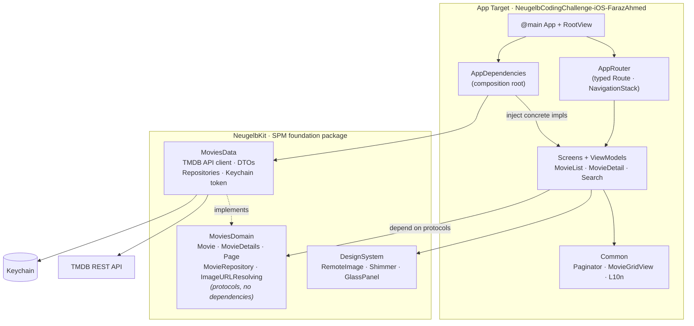
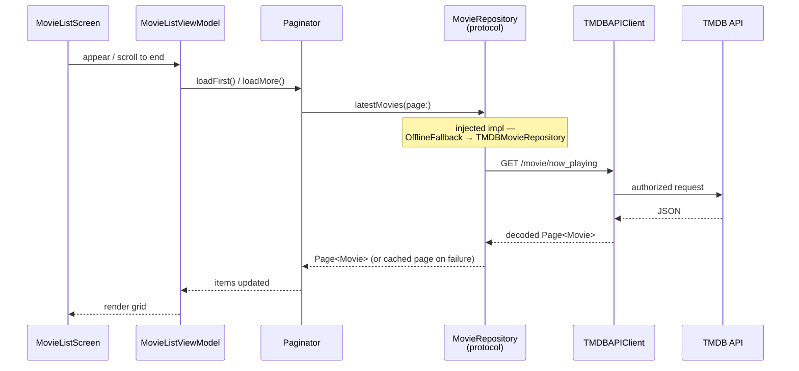

# Neugelb Movies

A SwiftUI client for [The Movie Database (TMDB)](https://www.themoviedb.org), built for the Neugelb iOS coding challenge. It shows the latest movies with infinite scrolling, a rich detail screen, and free-text search with live suggestions.

- **Platform:** iOS 18+
- **UI:** SwiftUI, `@Observable` view models, light/dark + Dynamic Type, English & German
- **Concurrency:** Swift 6 strict concurrency, `async/await` throughout

---

## Features

- **Now Playing** list with infinite scrolling and a featured hero carousel
- **Movie detail** screen with backdrop, overview, ratings, and a YouTube trailer link
- **Search** with debounced live suggestions and a full results grid
- **Offline fallback** — the last loaded list is cached to disk and shown when the network is unavailable
- **Resilient auth** — Keychain-backed TMDB token with a first-launch entry screen
- **Accessibility** — VoiceOver labels, accessibility identifiers, and skeleton/shimmer loading states

---

## Architecture

The app follows **MVVM with a Router**, layered so that policy (domain) never depends on detail (data or UI). The reusable foundation lives in a Swift package (`NeugelbKit`); feature screens and view models live in the app target and build on top of it.

The key rule: **view models depend only on domain protocols**. Concrete data implementations are wired in once, at the composition root (`AppDependencies`), and injected down. This keeps features testable against mocks and lets the data layer change without touching the UI.



### Layers

| Layer | Lives in | Responsibility | Depends on |
| --- | --- | --- | --- |
| **MoviesDomain** | `NeugelbKit` | Pure model types (`Movie`, `MovieDetails`, `Page`) and the abstractions (`MovieRepository`, `ImageURLResolving`). No third-party or Apple-framework coupling. | nothing |
| **MoviesData** | `NeugelbKit` | TMDB networking, DTO decoding, repository implementations, offline disk cache, and Keychain-backed token storage. | MoviesDomain |
| **DesignSystem** | `NeugelbKit` | App-agnostic UI primitives — remote image loading, shimmer skeletons, glass panels, rating badges. | — |
| **Features** | App target | SwiftUI screens + `@Observable` view models for MovieList, MovieDetail, and Search, plus shared `Paginator`/`MovieGridView`. | MoviesDomain, DesignSystem |
| **Composition root** | App target | `AppDependencies` builds the concrete graph and injects it; `AppRouter` owns navigation. | MoviesData, MoviesDomain |

### Request flow

How a list load travels through the layers — note that the view model only ever talks to the `MovieRepository` protocol:



---

## Project structure

```
.
├── NeugelbCodingChallenge-iOS-FarazAhmed/      # App target
│   ├── NeugelbCodingChallenge_iOS_…App.swift   # @main entry
│   ├── RootView.swift                          # NavigationStack host + token sheet
│   ├── SplashView.swift                        # Launch splash
│   ├── AppDependencies.swift                   # Composition root
│   ├── TokenEntryView.swift                    # First-launch token entry
│   └── Features/
│       ├── MovieList/                          # List screen, carousel, view model
│       ├── MovieDetail/                        # Detail screen + view model
│       ├── Search/                             # Results + suggestions + view model
│       ├── Navigation/                         # AppRouter, Route
│       └── Common/                             # Paginator, MovieGridView, L10n, cards
│
├── Packages/NeugelbKit/                         # Foundation SPM package
│   └── Sources/
│       ├── MoviesDomain/                       # Models + protocols
│       ├── MoviesData/                          # TMDB networking, repos, Keychain
│       ├── DesignSystem/                        # Reusable UI primitives
│       └── TestSupport/                         # Shared mocks & factories
│
├── NeugelbCodingChallenge-iOS-FarazAhmedTests/  # App-target unit tests
├── Makefile                                      # `make test` runs both test surfaces
└── Secrets.example.plist                         # Token template (see Setup)
```

---

## Setup

### Requirements

- Xcode 16+ (iOS 18 SDK)
- An iOS 18 simulator (the project defaults to **iPhone 17 Pro**)

### TMDB access token

The app authenticates with a TMDB **v4 read access token** (a Bearer token). You can supply it two ways:

1. **First-launch screen (no setup):** just build and run. If no token is found, the app prompts for one and stores it in the **Keychain**.
2. **Bundled secret (for repeat runs):** copy the template and paste your token:
   ```sh
   cp Secrets.example.plist NeugelbCodingChallenge-iOS-FarazAhmed/Secrets.plist
   # then edit Secrets.plist and set TMDB_ACCESS_TOKEN
   ```
   `Secrets.plist` is gitignored and seeds the Keychain on first launch.

Get a token at <https://www.themoviedb.org/settings/api>.

> **Security note:** any client-side secret is extractable from a device. The Keychain protects it at rest, but the production-grade answer is a backend proxy that holds the token server-side. That trade-off is called out deliberately rather than hidden.

---

## Running tests

The suite spans two surfaces — the app target's unit tests and the `NeugelbKit` package tests — which a single `xcodebuild` invocation can't run together. A `Makefile` wraps both:

```sh
make test          # everything (package + app)
make test-app      # app-target unit tests only
make test-package  # NeugelbKit package tests only
```

Override the simulator if needed:

```sh
make test DESTINATION='platform=iOS Simulator,name=iPhone 16 Pro'
```

---

## Key decisions & trade-offs

- **Foundation in a package, features in the app.** Domain/data/design-system are reusable and independently testable in `NeugelbKit`; feature screens stay in the app target to avoid module-boundary ceremony (public access, per-module bundles) for code that isn't shared. This keeps the package surface small and intentional.
- **Dependency inversion at one seam.** View models know only `MovieRepository`/`ImageURLResolving`. `AppDependencies` is the single place that names concrete types, so tests inject mocks and the data layer evolves freely.
- **Offline fallback as a decorator.** `OfflineFallbackMovieRepository` wraps the remote repository and a disk cache, so resilience is composed rather than baked into the TMDB client.
- **Generic pagination.** A single `Paginator` drives both the list and search, keeping load-more / retry / empty-state logic in one tested place.
- **Keychain-first token with a graceful prompt.** No secrets in the repo; reviewers can run with zero config and enter a token once.
